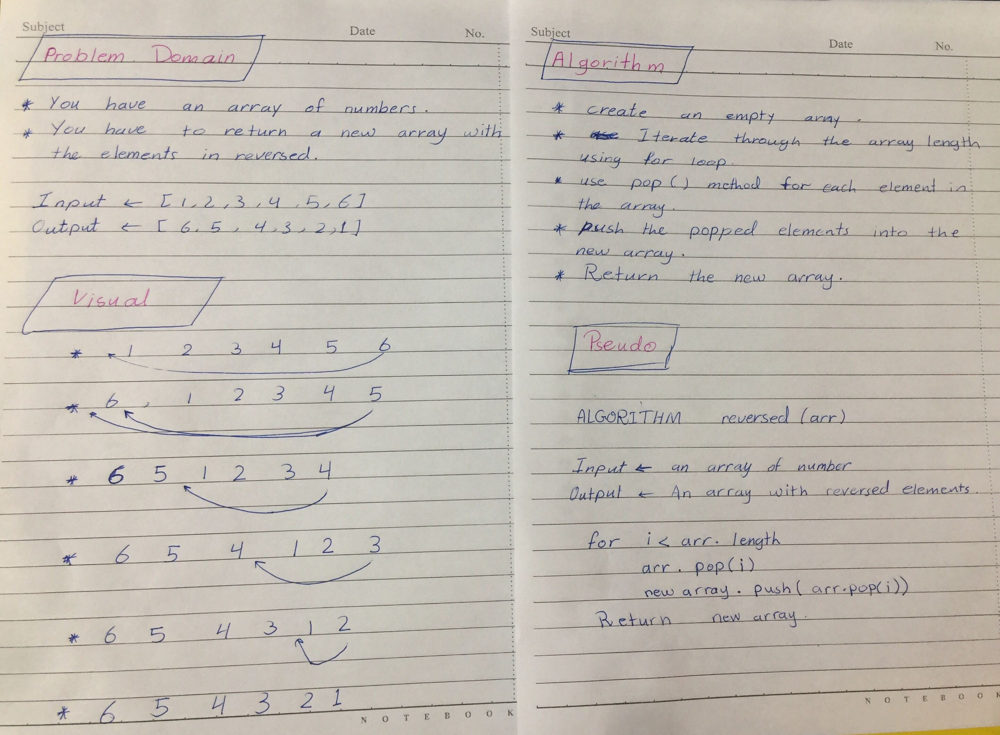

# 401-data-structures-and-algorithms
## Problem Domain
You have an array of numbers . You have to return a new array with the elements in reversed.
 order.
 * Input : [1, 2, 3, 4, 5, 6].
 * Output : [6, 5, 4, 3, 2, 1].

 ##  Visual

 

 ##  Algorithm 
 * Create an empty array.
 * Iterate through the array length using for loop.
 * Use pop() method for each elements in the array.
 * Push the popped elements into the new array .
 * Return the new array.

 ## Pseudocode
 ALGORITHM reversed(arr):

 - Input <-- an array of numbers.
 - Output <-- an array with reversed elements .

 for i<arr.length 

 arr.pop(i)

 new array.push(arr.pop(i))

 return new array.

 ## Code
 let x = [1, 2, 3, 4, 5, 6,7,8];
function reversed (arr){
  let newA = [];

for (let i = 0; i<arr.length; i+2){

  let o = arr.pop(i);

  newA.push(o);
  
}

console.log(newA);
}

reversed(x);

